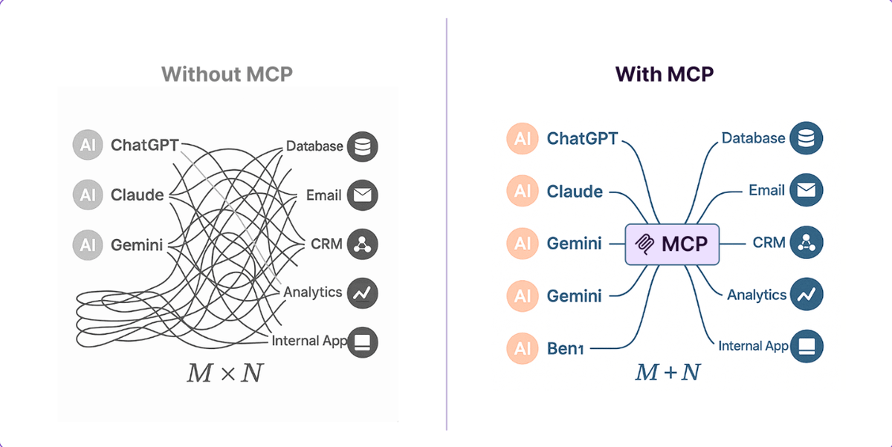
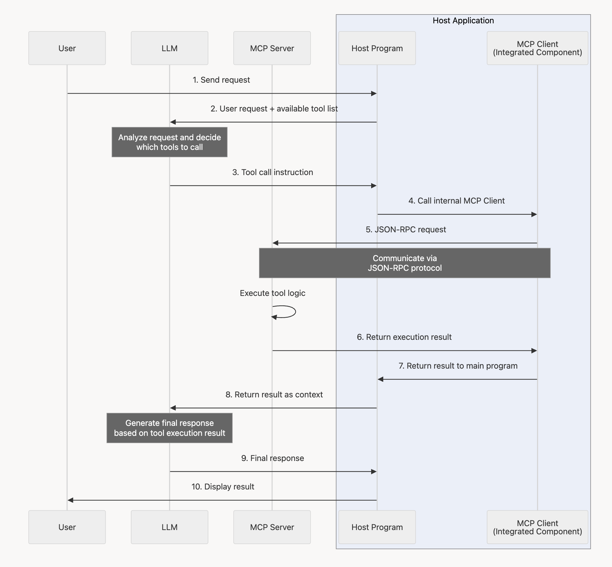
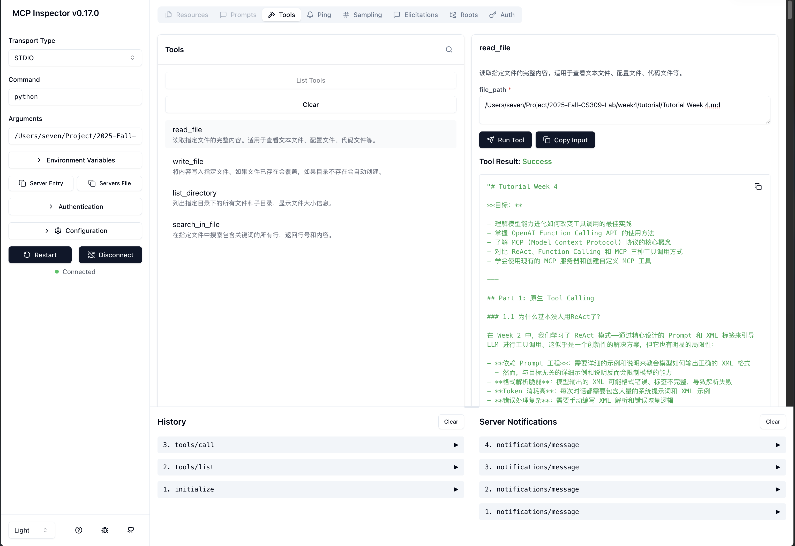

# Tutorial Week 4

**Objectives:**

- Understand how model capability evolution has transformed best practices for tool calling
- Master the OpenAI Function Calling API
- Learn the core concepts of the MCP (Model Context Protocol)
- Compare three tool calling approaches: ReAct, Function Calling, and MCP
- Learn to use existing MCP servers and create custom MCP tools

---

## Part 1: Native Tool Calling

### 1.1 Why Is ReAct Barely Used Anymore?

In Week 2, we studied the ReAct pattern—guiding LLMs to perform tool calls through carefully crafted prompts and XML tags. While this seemed like an innovative solution, it has obvious limitations:

- **Reliance on Prompt Engineering**: Requires detailed examples and instructions to teach the model how to output correct XML formatting
  - However, verbose examples and instructions unrelated to the goal actually limit the model's capabilities
- **Fragile Format Parsing**: Model-generated XML may have formatting errors or incomplete tags, leading to parsing failures
- **High Token Consumption**: Every conversation must include extensive system prompts and XML examples
- **Complex Error Handling**: Requires manual XML parsing and error recovery logic

**Why Was ReAct Once Necessary?**

Early LLMs (like GPT-3.5) had limited instruction-following capabilities and couldn't reliably output structured data. Therefore, researchers used prompt engineering techniques (such as Chain-of-Thought and ReAct) to guide models through complex tasks step by step.

**The Capability Leap**

With the emergence of new-generation LLMs (GPT-5, Claude 4.5, Gemini 2.5, etc.), model capabilities have made a qualitative leap:

1. **Stronger Instruction-Following Ability**: Models can accurately understand and execute complex instructions
2. **Native Support for Structured Output**: Models can directly output data in JSON, XML, and other formats
3. **Function Calling as a Standard Feature**: Mainstream API providers now have built-in tool calling functionality

By default, this course recommends prioritizing Function Calling for building agents; only consider ReAct when you need fully controllable custom reasoning chains or when using models that don't support function calling.

---

### 1.2 OpenAI Function Calling API

[Official Documentation](https://platform.openai.com/docs/guides/function-calling)

Function Calling allows models to intelligently choose which tool to call and generate parameters that conform to the tool definition.

**Core Concepts**

1. **Tool Definition**: Describing tool functionality and parameters using JSON Schema format
2. **Tool Choice**: Controlling whether the model must call tools and which tool to call
3. **Tool Calls**: Structured tool call requests returned by the model
4. **Tool Execution and Feedback**: Returning results to the model after executing tools

**Function Calling Workflow Diagram**


The diagram above shows the complete Function Calling flow:

1. Developer sends tool definitions and user message
2. Model returns tool call request
3. Developer executes function code and obtains results
4. Returns results to the model
5. Model generates final response

**Basic Flow**

`week4/function_calling.py` demonstrates the complete Function Calling flow using file operations as an example:

**Important Parameter Explanations**

- **`tool_choice`**:
  - `"auto"`: Model automatically decides whether to call tools (default)
  - `"none"`: Forces no tool calls
  - `{"type": "function", "function": {"name": "read_file"}}`: Forces calling a specific tool
  - `"required"`: Forces calling some tool (any one)

- **`parallel_tool_use`**:
  - The model can return multiple tool call requests at once, executing them in parallel for efficiency
  - For example: simultaneously reading multiple files or batch querying multiple records
  - When enabled, results must be written back individually according to `tool_call.id` to avoid mixing outputs from different tools
  - Typical handling approach:

```python
response = client.chat.completions.create(
    model="gpt-5",
    messages=messages,
    tools=tools,
    parallel_tool_use=True
)

for tool_call in response.choices[0].message.tool_calls:
    result = available_functions[tool_call.function.name](**json.loads(tool_call.function.arguments))
    messages.append({
        "role": "tool",
        "tool_call_id": tool_call.id,
        "name": tool_call.function.name,
        "content": result
    })
```

  - If tools share resources (e.g., the same file or database connection), manage concurrency yourself to avoid race conditions

**Execution Flow Explanation**

In the example above, the model will:

1. Analyze the user request and determine it needs to `read_file` first
2. Return the first tool call request: `read_file("/tmp/todo.txt")`
3. We execute it and return the file content to the model
4. The model calls the tool again: `write_file("/tmp/todo.txt", "# Today's Tasks\nOriginal content...")`
5. After execution completes, the model generates the final response: "Successfully added title"

This demonstrates Function Calling's **multi-round tool calling** capability.

**What Makes It Better?**

In ReAct, we need:
```xml
<thought>User wants to modify file, I need to read file content first</thought>
<action>read_file("/tmp/todo.txt")</action>
<observation>File content...</observation>
<thought>Now I need to add a title at the beginning and write back to file</thought>
<action>write_file("/tmp/todo.txt", "# Today's Tasks\nOriginal content...")</action>
<observation>Write successful</observation>
<final_answer>Successfully added title</final_answer>
```

In Function Calling, the model directly returns structured tool calls:
```json
{
  "tool_calls": [{
    "function": {
      "name": "read_file",
      "arguments": "{\"file_path\": \"/tmp/todo.txt\"}"
    }
  }]
}
```

**Advantages Are Obvious**:

- ✅ No XML parsing needed
- ✅ Automatic JSON formatting of parameters
- ✅ API automatically validates parameter types
- ✅ Lower token consumption

---

### 1.3 Quantitative Comparison

Let's compare the performance differences between ReAct and Function Calling through an actual task.

| Metric | ReAct Agent (Week2) | Function Calling Agent | Difference |
|--------|---------------------|------------------------|------------|
| **Lines of Code** | 221 lines | 311 lines (with examples) | Core implementation: 150 vs 80 lines |
| **Average Token Consumption** | 1118 tokens | 478 tokens | ⬇️ **57.2% savings** 🎯 |
| **Average Response Time** | 6.23 seconds | 3.97 seconds | ⬇️ **36% faster** ⚡ |
| **Average Tool Calls** | 2.3 times | 1.3 times | ⬇️ 43% reduction |
| **Error Handling Complexity** | Manual XML parsing | API automatic handling | ⬇️ Significantly reduced |

**Test Case Details**:

- Simple file read: 986 → 364 tokens (63% savings)
- File modification: 1106 → 639 tokens (42% savings)
- Directory browsing: 1261 → 432 tokens (66% savings)

**Why Does Function Calling Save So Many Tokens?**

1. **More concise system prompts**: JSON Schema (compact) vs XML examples (verbose)
2. **No tag overhead**: No need for `<thought>`, `<action>`, `<observation>` XML tags
3. **More precise tool calls**: ReAct sometimes needs multiple attempts (directory browsing case: 4 times vs 1 time)
4. **Native protocol support**: Model directly outputs structured calls with no redundant text

**Experiment Code**

You can use the `compare.py` script to automate this comparison experiment:

```bash
cd week4
python compare.py
```

This will run 3 test cases and output a detailed comparison report.

---

## 1.4 Tool Design Best Practices

Based on practical experience, good tool design should follow these principles:

1. **Clear Naming and Descriptions**
   - ✅ Good naming: `search_contacts` (search contacts)
   - ❌ Bad naming: `list_contacts` (might list all contacts)
   - Use namespaces to avoid confusion, e.g., `asana_projects_search`

2. **Optimize for Agents, Not Simple API Wrappers**
   - ✅ Good design: `schedule_event` automatically finds available times and creates schedule
   - ❌ Bad design: Separately providing `list_availability` and `create_event`, making the agent brute-force search

3. **Control Information Volume**
   - Add `response_format` parameter, letting the agent choose detail level (`summary` vs `detailed`)
   - Avoid returning low-signal technical identifiers (like UUIDs), prioritize human-readable information
   - Use pagination or filtering to avoid returning massive data that overwhelms the agent's context

4. **Clear Parameter Definitions**
   - Provide clear types, constraints, and examples
   - Distinguish required vs optional parameters
   - Explain parameter purpose and impact in descriptions

5. **Targeted Tools Rather Than Universal Tools**
   - ✅ Good design: `get_customer_context(customer_id)` returns key customer information summary
   - ❌ Bad design: `get_customer_data(customer_id)` returns all raw customer data

> ⚠️ When designing tools, write tool descriptions as if explaining tasks to a new colleague, not simply exposing technical APIs.


---

## Part 2: MCP (Model Context Protocol)

### 2.1 What is MCP

**Model Context Protocol (MCP)** is an open protocol standard proposed by Anthropic in 2024, aimed at solving the fragmentation problem of tool and data source integration in LLM applications.

**Core Problem: The M × N Integration Dilemma**

Before MCP:

- Each LLM application needed to implement its own tool integrations (file I/O, database queries, API calls, etc.)
- Tools couldn't be reused across applications, developers reinvented the wheel
- No unified security and permission management standards
- Fragmented tool ecosystem, difficult to form network effects

As shown in the diagram below, each AI application (M) needs to separately integrate with each data source (N), resulting in **M × N integration complexity**:



**MCP's Solution: M + N Standardized Architecture**

MCP provides a unified protocol that allows LLM applications (Hosts) to access various tool servers through a standard interface. This reduces integration complexity from **M × N to M + N**.

**Analogy for Understanding**

- **Traditional approach**: Each device has a dedicated charger (incompatible)
- **MCP approach**: USB-C unified interface, all devices can use it (standardized)
- Adapter pattern & Bridge pattern

**MCP's Current State: A Developer's Paradise 😅**


Currently, the MCP ecosystem is in its early stages, with far more people developing MCP Servers than actually using them. But this is the eve of an ecosystem explosion—just like the early days of npm and PyPI, tool ecosystem building always precedes large-scale adoption.

---

### 2.2 MCP Architecture

**Three Core Components**

1. **MCP Host (Client Application)**
   - Examples: Cursor, Claude Desktop, Github Copilot
   - Responsible for user interaction and connecting to tool servers via MCP protocol
   - Exposes tool capabilities for LLM use

2. **MCP Client (Protocol Client)**
   - Protocol implementation embedded in the Host
   - Handles communication with Servers (via stdio or HTTP)
   - Manages connections, requests, responses

3. **MCP Server (Tool Server)**
   - Provides specific tools and data sources
   - Examples: file system operations, database queries, API calls
   - Exposes capabilities through MCP protocol


<!-- ``` mermaid
sequenceDiagram
    participant User as User
    participant LLM as LLM
    participant Server as MCP Server

    box rgba(200, 220, 255, 0.3) Host Application
        participant Host as Host Program
        participant Client as MCP Client<br/>(Integrated Component)
    end

    User->>Host: 1. Send request
    Host->>LLM: 2. User request + available tool list
    Note over LLM: Analyze request and decide<br/>which tools to call
    LLM->>Host: 3. Tool call instruction

    Host->>Client: 4. Call internal MCP Client
    Client->>Server: 5. JSON-RPC request
    Note over Client,Server: Communicate via<br/>JSON-RPC protocol
    Server->>Server: Execute tool logic
    Server->>Client: 6. Return execution result
    Client->>Host: 7. Return result to main program

    Host->>LLM: 8. Return result as context
    Note over LLM: Generate final response<br/>based on tool execution result
    LLM->>Host: 9. Final response
    Host->>User: 10. Display result
``` -->

**Communication Methods**

- **stdio (standard input/output)**
- **HTTP + SSE (Server-Sent Events)**

When to use stdio vs Streamable HTTP?

- If client/server on same device → stdio
- If cross-device communication → Streamable HTTP

**MCP Protocol's Three Core Capabilities**


1. **Tools**
   - The most important capability, most MCP Servers only provide tools
   - Executable functions, e.g., file I/O, code execution, search queries
   - Define parameters and return values using JSON Schema
   - Examples: `read_file(path)`, `search_web(query)`

2. **Resources**
   - Expose data and content, e.g., database records, API responses, images, documents

3. **Prompts (Prompt Templates)**
   - Predefined prompt templates for users to quickly start specific tasks
   - Support parameterization

---

### 2.3 MCP Ecosystem

**MCP Hub and Server Marketplaces**

Mainstream MCP server discovery platforms:

**1. [Smithery.ai](https://smithery.ai/)**

- Anthropic's officially recommended MCP server marketplace
- Provides one-click installation, community ratings, and detailed documentation
- Supports direct configuration in Claude Desktop

**2. [mcp.so](https://mcp.so/)**

- Open-source MCP server directory
- Real-time updated server list
- Community-contributed best practices

**Official Reference Implementations**

Anthropic officially provides a series of reference implementations: [github.com/modelcontextprotocol/servers](https://github.com/modelcontextprotocol/servers)

Common MCPs:

- **`@modelcontextprotocol/server-filesystem`**: File system operations
  - Features: Read/write files, list directories, search files
  - Install: `npm install -g @modelcontextprotocol/server-filesystem`

- **`@modelcontextprotocol/server-github`**: GitHub API
  - Features: Create Issues/PRs, search code, manage repositories

- **`@modelcontextprotocol/server-postgres`**: PostgreSQL database
  - Features: Execute queries, get table structure, data analysis

- **`@modelcontextprotocol/server-brave-search`**: Web search
  - Features: Real-time web search, news queries

Potentially helpful for course projects:

- **`@upstash/context7-mcp`**: Documentation retrieval tool
  - Features: Query documentation for mainstream libraries
  - Particularly suitable for reducing model hallucinations during coding

- **`@microsoft/playwright-mcp`**: Playwright automation MCP from Microsoft
  - Features: Let LLMs control browsers

**How to Use Existing MCP Servers**

Using clients:

- **Cherry Studio**: (Open-source BYOK client with broad community support)
- **Claude Desktop**: (Anthropic official client, downside is difficult registration in China)
- **Codex/Claude Code**: (Mainly for coding)

Writing custom clients: See code examples

Using `server-filesystem` as an example:

```bash
# 1. Install (Node.js method)
npm install -g @modelcontextprotocol/server-filesystem

# 2. Configure in MCP-supporting client (using Claude Desktop as example)
# Edit ~/Library/Application Support/Claude/claude_desktop_config.json
{
  "mcpServers": {
    "filesystem": {
      "command": "npx",
      "args": [
        "-y",
        "@modelcontextprotocol/server-filesystem",
        "/Users/yourname/Documents"  // Allowed access directory
      ]
    }
  }
}

# 3. Restart Claude Desktop, tools are ready to use
```


---

### 2.4 Three-Way Comparison: ReAct vs Function Calling vs MCP

Let's add MCP to the comparison matrix:

| Dimension | ReAct Agent | Function Calling Agent | MCP + Official Server |
|-----------|-------------|------------------------|----------------------|
| **Implementation Code Lines** | ~220 lines | ~120 lines | ~50 lines (client only) |
| **Tool Definition Method** | Hand-written Python functions + Prompt | Hand-written Python functions + JSON Schema | **Use existing Server, zero code** |
| **Maintainability** | Low (coupled in code) | Medium (functions separated from Agent) | **High (protocol standardized)** |
| **Reusability** | Low (this project only) | Medium (manual adaptation needed) | **High (any MCP Host can use)** |
| **Ecosystem Compatibility** | None | OpenAI/compatible APIs only | **Claude Desktop, Continue.dev, etc.** |
| **Error Handling** | Manual writing | API basic validation | **Protocol-level unified error handling** |
| **Cross-Application Sharing** | No | No | **Yes (MCP standard)** |

**Key Insights**

- **ReAct**: Suitable for research and custom reasoning chains, but not recommended for production
- **Function Calling**: Mainstream solution, suitable for most application scenarios
- **MCP**: Most advanced approach, achieves tool ecosystem sharing through standardized protocol, represents the future direction

---

## Part 3: Practical Projects

### 3.1 Using Official MCP Filesystem Server

**Task**: Use the official `@modelcontextprotocol/server-filesystem` to complete the Week 2 snake game task

**Steps**

```bash
# 0. Install Node.js (if not already installed)
Reference https://nodejs.org/en/download

# 1. Install Python MCP SDK
pip install mcp

# 2. Globally install filesystem server (or use npx)
npm install -g @modelcontextprotocol/server-filesystem

# 3. Run our provided client
cd week4
python mcp_official_client.py
```

**Code Volume Comparison**

- ReAct Agent: ~220 lines (complete implementation)
- Function Calling Agent: ~120 lines (tools + Agent)
- MCP Client: **~50 lines** (client logic only, tools provided by official Server)

**Experience Difference**

Using MCP, you only need to focus on:

1. Connecting to MCP Server
2. Calling LLM and passing available tool list
3. Executing tool calls and returning results

**All tool implementation, security checks, error handling are completed by the official Server**, you don't need to redevelop.

---

### 3.2 Using MCP Inspector for Server Debugging

**What is MCP Inspector?**

`@modelcontextprotocol/inspector` is a debugging tool provided by Anthropic specifically for testing and debugging MCP servers. It provides an interactive web interface that can:

- View all tools, resources, and prompt templates provided by the server
- Test tool calls and view returned results
- View server logs and errors in real-time
- Verify server functionality without writing client code

**How to Use**

```bash
npx @modelcontextprotocol/inspector
```

**Inspector will:**

1. Start your MCP Server
2. Open the debugging interface in a browser
3. Connect to the server and display available tools

**Use Cases**

- ✅ **Development stage**: Quickly verify tool definitions are correct
- ✅ **Debugging stage**: View tool call inputs/outputs, locate issues
- ✅ **Testing stage**: Functional testing before integrating into actual applications
- ✅ **Documentation demos**: Demonstrate MCP Server capabilities to others

**Inspector Interface Features**



> 💡 **Best Practice**: When developing MCP Servers, always test with Inspector first, confirm tools work normally before integrating into actual applications.

---

### 3.3 Creating Custom MCP Server

**Scenario**: When official Servers don't meet your needs, create your own tools

**Example**: `week4/mcp_custom_server.py` provides a simple MCP Server example

**Using Custom Server**

```bash

# Configure in MCP-supporting client:
"custom_mcp": {
    "name": "custom_mcp",
    "type": "stdio",
    "description": "",
    "isActive": true,
    "command": "python",
    "args": [
    "Path/To/mcp_custom_server.py"
    ]
}
```

---

## Part 4: Best Practices

### 4.1 Tool Design Principles

Based on Anthropic's engineering practices, good tool design should:

**1. Optimize for Agents, Not Simple API Wrappers**

```python
# ❌ Bad: Requires agent to make multiple calls and iterate
@app.tool()
async def list_events(date: str) -> list:
    """List all events for a given day"""
    return await calendar.get_events(date)

# ✅ Good: Intelligent tool, completes task in one call
@app.tool()
async def schedule_meeting(title: str, duration_minutes: int,
                          preferred_date: str, participants: list[str]) -> str:
    """Intelligently schedule meeting, automatically find common available time for all participants"""
    slots = await find_common_availability(participants, preferred_date)
    if not slots:
        return f"Error: No {duration_minutes}-minute common availability on {preferred_date}"
    event = await calendar.create_event(title, slots[0].start, slots[0].end, participants)
    return f"Successfully scheduled meeting: {event.url}"
```

**2. Control Information Volume, Avoid Context Pollution**

```python
from typing import Literal

@app.tool()
async def get_customer_info(
    customer_id: str,
    detail_level: Literal["summary", "detailed"] = "summary"
) -> str:
    """
    Get customer information

    Args:
        detail_level: summary=key info, detailed=includes history
    """
    # Return different levels of detail based on detail_level
```

**3. Clear Naming and Documentation**

- Use verbs at start: `search_contacts` not `list_contacts`
- Provide clear parameter explanations and examples
- Use namespaces to avoid confusion: `asana_projects_search`

---

### 4.2 Common Pitfalls and Solutions

#### Pitfall 1: Print Statements in STDIO Mode

```python
# ❌ Wrong: Breaks MCP protocol
print("Debug: Processing request...")

# ✅ Correct: Output to stderr
import logging, sys
logging.basicConfig(handlers=[logging.StreamHandler(sys.stderr)])
logger = logging.getLogger(__name__)
logger.info("Processing request...")
```

#### Pitfall 2: Forgetting Async Handling

> ⚠️ MCP servers are **single-threaded asynchronous** (at least for Python/TS/JS), for more on async programming, search: event loop, coroutines, asyncio

```python
# ❌ Wrong: Blocks event loop
time.sleep(10)

# ✅ Correct: Non-blocking wait
await asyncio.sleep(10)

# ✅ Handling synchronous I/O
loop = asyncio.get_event_loop()
content = await loop.run_in_executor(None, read_large_file, file_path)
```

#### Pitfall 3: Unsafe File Operations

```python
# ❌ Wrong: Can read any file
@app.tool()
async def read_file(path: str) -> str:
    with open(path) as f:
        return f.read()

# ✅ Correct: Path whitelist validation
from pathlib import Path

ALLOWED_DIR = Path("/safe/workspace")

@app.tool()
async def read_file(path: str) -> str:
    file_path = Path(path).resolve()
    if not str(file_path).startswith(str(ALLOWED_DIR.resolve())):
        return f"Error: Can only access files within {ALLOWED_DIR} directory"
    with open(file_path) as f:
        return f.read()
```

---

## Extended Reading

1. **OpenAI Function Calling Official Documentation**
   [https://platform.openai.com/docs/guides/function-calling](https://platform.openai.com/docs/guides/function-calling)
   - Complete API documentation and examples for Function Calling

2. **Anthropic: Writing Tools for AI Agents**
   [https://www.anthropic.com/engineering/writing-tools-for-agents](https://www.anthropic.com/engineering/writing-tools-for-agents)
   - Tool design best practices from Anthropic's engineering team
   - Real case studies and common pitfalls

3. **Claude Tool Use Documentation**
   [https://docs.claude.com/en/docs/agents-and-tools/tool-use/overview](https://docs.claude.com/en/docs/agents-and-tools/tool-use/overview)
   - Claude's tool calling capabilities and usage guide

4. **Anthropic MCP Protocol Specification**
   [https://modelcontextprotocol.io/](https://modelcontextprotocol.io/)
   - Official documentation and specification for MCP protocol

5. **MCP Official Server Repository**
   [https://github.com/modelcontextprotocol/servers](https://github.com/modelcontextprotocol/servers)
   - Officially maintained reference implementations and examples

6. **Smithery MCP Marketplace**
   [https://smithery.ai/](https://smithery.ai/)
   - Anthropic-recommended MCP Server discovery platform

7. **MCP Community Directory**
   [https://mcp.so/](https://mcp.so/)
   - Open-source MCP Server list

8. **Claude Desktop MCP Configuration Guide**
   [https://modelcontextprotocol.io/quickstart/user](https://modelcontextprotocol.io/quickstart/user)
   - Configure and use MCP in Claude Desktop

---

## Reflection Questions

1. **Model Evolution**: Why does improved model capability make native Tool Calling outperform ReAct? In what scenarios might ReAct still have advantages?

2. **Parallel Tool Calls**: In what scenarios is Function Calling's `parallel_tool_use` feature most useful? Can you give a practical example?

3. **MCP vs REST API**: What's the fundamental difference between MCP protocol and traditional REST API wrappers? Why can MCP promote tool ecosystem formation?

4. **Security Design**: How would you design a secure MCP code execution tool? (Hint: consider sandboxing, permission control, resource limits)

5. **RAG Integration**: Try wrapping Week 3's RAG system as an MCP Server and use it in any client. What challenges did you encounter?

6. **Ecosystem Exploration**: Choose an MCP Server from Smithery.ai or mcp.so that interests you, integrate it into your project, and share your experience.

7. **Cost Optimization**: In production environments, how would you choose between ReAct, Function Calling, and MCP? Consider multiple dimensions like development cost, operating cost, maintenance cost.

8. **Protocol Evolution**: MCP is still a relatively new protocol. How do you think it will evolve in the future? What challenges might it face?

---

## Lab Tasks

### Task 1: Comparison Experiment

Run the `compare.py` script to compare performance differences of three approaches (ReAct, Function Calling, MCP) completing the same task:

```bash
cd week4
python compare.py --task "Create a snake game" --runs 10
```

Generate a comparison report and analyze the results.

### Task 2: Using Official MCP Server

Install and configure `@modelcontextprotocol/server-filesystem`, use it to complete a file operation task (e.g., organizing documents, batch renaming, etc.).

### Task 3: Create Custom MCP Server

Create a custom MCP Server that enables LLMs to perform polynomial calculations, and test its functionality in mcp-inspector (recommended to use the Sympy library).
